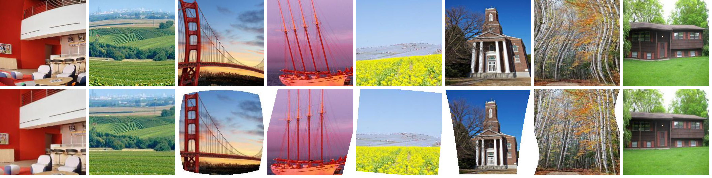

# GeoProj

### [Project page](https://xiaoyu258.github.io/projects/geoproj) | [Paper](https://arxiv.org/abs/1909.03459)

The source code of Blind Geometric Distortion Correction on Images Through Deep Learning by Li et al, CVPR 2019. 

 

## Prerequisites
- Linux or Windows
- Python 3
- CPU or NVIDIA GPU + CUDA CuDNN

## Getting Started

### Dataset Generation
In order to train the model using the provided code, the data needs to be generated in a certain manner. 

You can use any distortion-free images to generate the dataset. In this paper, we use [Places365-Standard dataset](http://places2.csail.mit.edu/download.html) at the resolution of 512*512 as the original non-distorted images to generate the dataset.

Run the following command for dataset generation:
```bash
python data/dataset_generate.py 
```

### Training

### Use a Pre-trained Model

### Resampling

## Citation
```bash
@inproceedings{li2019blind,
  title={Blind Geometric Distortion Correction on Images Through Deep Learning},
  author={Li, Xiaoyu and Zhang, Bo and Sander, Pedro V and Liao, Jing},
  booktitle={Proceedings of the IEEE Conference on Computer Vision and Pattern Recognition},
  pages={4855--4864},
  year={2019}
}
```
